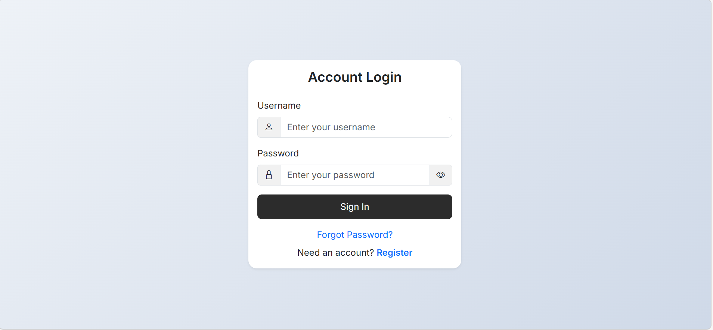
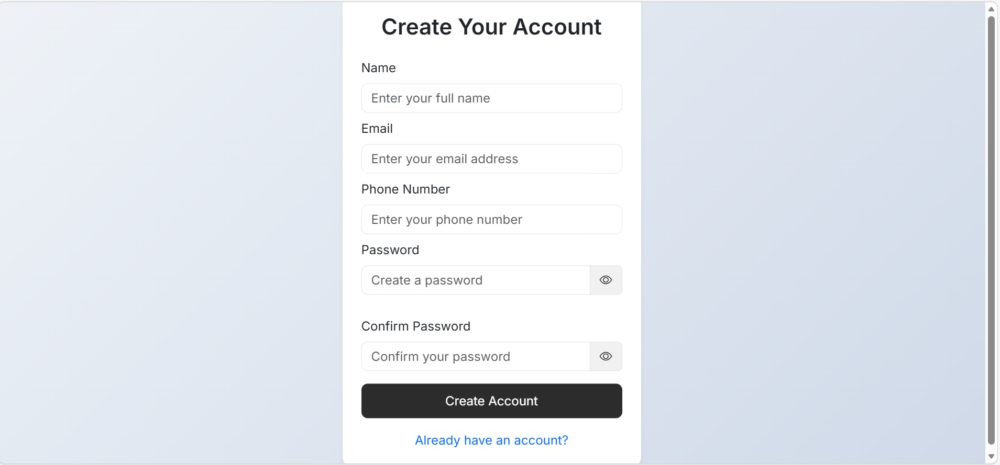
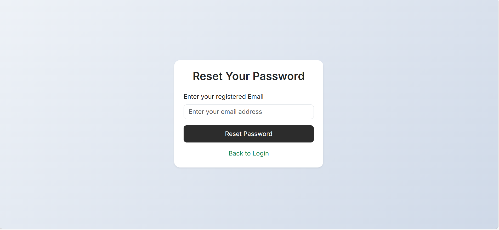
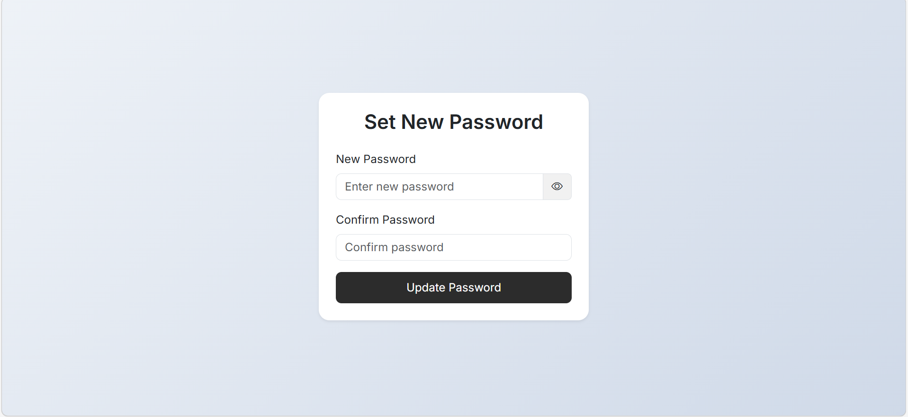
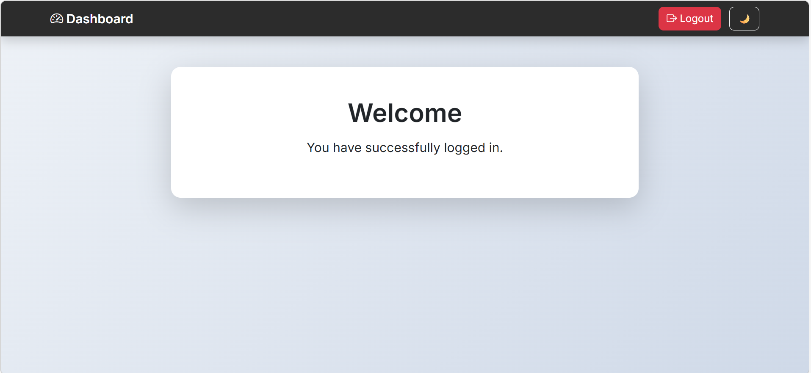

# Authentication System

This project is a simple authentication system using HTML, CSS and Bootstrap.

It has multiple pages connected together like login, register, forgot password and dashboard.

## Pages
- index.html
- register.html
- forgot-password.html
- reset-password.html
- dashboard.html

## Features
- Used Bootstrap for design
- Added custom CSS
- Responsive for mobile and desktop
- Dark mode toggle
- Password strength check in register page

## How to run
Open any HTML file in browser and navigate using links.

## Screenshots

Login Page:

Register Page:

Forgot Password Page:

Reset Password Page:

Dashboard Page:

## Note
This project is created for assignment purpose and no templates are used.